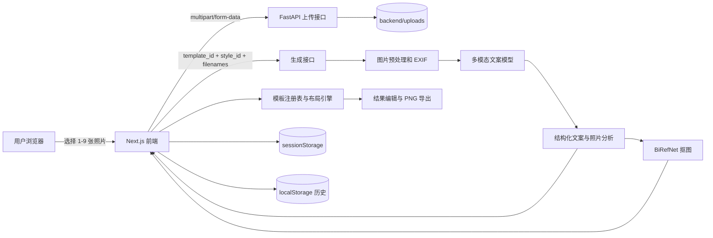

# DayFrame

DayFrame 是一个 AI 图文生活记录 Web 应用。用户可以上传一天内的 1–9 张照片，选择文字风格和排版模板，由 AI 理解照片内容、生成日记文案，并在浏览器中完成自动排版、基础编辑和 PNG 长图导出。

当前仓库是可运行的前后端一体原型，不再是目录骨架。核心能力包括：

- 多次选择、追加和删除待上传照片，总数限制为 1–9 张。
- 多模态模型生成标题、日记正文、逐图说明、标签和照片结构化分析。
- 5 种排版模板：竖版长图、复古手账、波点拼贴、手绘标注、图片拼接。
- 复古手账和波点拼贴支持 BiRefNet 主体抠图及 1–9 张自适应布局。
- 结果页支持改字、重新生成文案、重新排版、拖动/缩放/旋转照片、切换原图/抠图、设置主图、调整背景和总结位置。
- 显式保存修改、未保存离开提醒、本机历史记录和 PNG 导出。

## 技术栈

| 层级 | 技术 |
| --- | --- |
| Web | Next.js 16 App Router、React 19、TypeScript 5 |
| UI | Tailwind CSS 4、站酷快乐体 `@fontsource/zcool-kuaile` |
| 图片导出 | `html-to-image` |
| API | FastAPI、Pydantic、Uvicorn |
| 多模态文案 | OpenAI Python SDK + OpenAI 兼容 Chat Completions API |
| 手绘定图 | OpenAI Images API，固定使用 `gpt-image-2` |
| 图片处理 | Pillow、NumPy、SciPy |
| 主体抠图 | rembg、ONNX Runtime、BiRefNet |
| 当前存储 | `sessionStorage`、`localStorage`、后端本地 `uploads/` |

## 系统架构



前后端的职责边界如下：

- **后端负责内容和素材**：上传、图片元数据提取、图片压缩、多模态理解、文案结构校验、主体抠图、手绘图片生成。
- **前端负责排版和编辑**：模板选择、自适应布局、装饰渲染、手工调整、背景切换、历史管理和截图导出。
- 布局坐标不由模型直接决定。模型只返回语义信息，前端布局引擎据此计算确定性坐标，避免生成图片不可编辑。

## 端到端生成流程

1. `frontend/src/app/upload/upload-form.tsx` 累计保存用户选择的 `File[]`，最多 9 张。
2. 前端调用 `POST /api/v1/images/upload`，后端校验格式和大小，以 UUID 文件名写入 `backend/uploads/`。
3. 前端调用 `POST /api/v1/generate`，传入：
   - `style_id`
   - `template_id`
   - 已上传文件名数组
   - `include_cutouts`
4. 普通模板进入 `backend/app/generate_copy.py`：
   - Pillow 读取尺寸、方向和 EXIF 拍摄时间。
   - 图片压缩到适合模型识别的尺寸，并转为 base64 多模态消息。
   - 加载模板对应提示词，调用 Chat Completions API。
   - 修复和解析模型 JSON，通过 Pydantic 规范化字段。
   - 保证 `captions[i]` 与第 `i` 张照片一一对应，并处理空文案、编号前缀和重复文案。
5. 复古手账和波点拼贴根据 `photo_analyses` 选择最多若干张候选图片运行 BiRefNet。
6. 前端将响应规范化为 `DayFrameCopy`、`PhotoAnalysis[]` 和 `CutoutAsset[]`。
7. 模板布局引擎根据照片数量、宽高比、重要度、主体类型、主图角色和抠图状态计算画布。
8. 生成结果写入当前会话和历史记录，随后进入 `/result` 编辑和导出。

## 模板实现

| 模板 | `template_id` | 内容生成 | 前端排版与特点 |
| --- | --- | --- | --- |
| 竖版长图 | `vertical-v1` | 通用多模态文案 | 标题、正文和照片纵向排列；支持 7 种背景色 |
| 复古手账 | `chalkboard-collage-v1` | 专用手账提示词、照片语义分析、文案完整性重试 | 1–9 张自适应拼贴、主体抠图、纸胶带和涂鸦；支持黑板色、浅色、复古渐变和揉皱纸背景 |
| 波点拼贴 | `polka-scrapbook-v1` | 当前使用通用多模态文案，同时返回布局分析 | 复用成熟的语义布局基础，使用独立波点、气泡和贴纸视觉；支持暖灰、浅蓝、浅绿和浅粉背景 |
| 手绘标注 | `hand-drawn-v1` | 不走 Chat 文案链路；逐图调用官方 `gpt-image-2` Images API | 后端直接返回已绘制标注的图片；当前文案为占位内容 |
| 图片拼接 | `image-collage-v1` | 图片拼接专用提示词 | 前端双列/长图拼接，不运行主体抠图 |

模板由 `frontend/src/lib/templates/registry.tsx` 统一注册。模板 ID 的共享定义位于：

- 前端：`frontend/src/lib/types.ts`
- 后端校验：`backend/app/schemas.py`

### 复古手账与波点布局

`compute-chalkboard-layout.ts` 是主要的 1–9 张布局引擎，核心输入包括：

- 图片真实宽高比和方向。
- AI 返回的 `importance`、`subjectType`、`layoutRole`。
- 是否有人脸、是否有可用抠图。
- 用户指定的原图/抠图覆盖项。
- `layoutSeed`，用于重新排版且保持结果可复现。

布局输出为 `TemplateLayout`，其中每个节点都有像素坐标、尺寸、旋转角度和层级。波点模板通过 `compute-polka-layout.ts` 使用独立模板 ID 和视觉层，避免两套模板的编辑状态互相污染。

## AI 文案与照片分析

普通模板使用 `OPENAI_MODEL` 指定的视觉模型。代码未设置环境变量时的回退值目前是 `gpt-4o-mini`；团队环境可以显式配置为 `gpt-4o`。

模型返回的核心结构：

```ts
type DayFrameCopy = {
  title: string;
  diary: string;
  captions: string[];
  hashtags: string[];
  photoAnalyses?: PhotoAnalysis[];
};
```

`PhotoAnalysis` 主要包含：

- 原图尺寸、宽高比、横竖方向和可用的拍摄时间。
- 重要度、主体类型、主体摘要、人脸状态和视觉焦点。
- `hero | support | detail` 布局角色。
- `frame | cutout | hero` 推荐渲染方式。
- `cutoutGroup` 和 `includeHumanParts`，用于保证人物、手臂、手持物等作为整体抠出。

当前提示词映射：

| 模板 | 提示词 |
| --- | --- |
| 复古手账 | `prompts/generate_chalkboard_system.md` |
| 图片拼接 | `prompts/generate_collage_system.md` |
| 竖版长图、波点拼贴 | `prompts/generate_copy_system.md` |
| 手绘定图 | `prompts/generate_plog.md` |

## 主体抠图

抠图入口为 `backend/app/cutout_service.py`，只在复古手账和波点拼贴生成时调用。

处理策略：

1. 按 `layoutRole` 和 `importance` 选择候选图片，默认最多 3 张。
2. 人像、合照、人脸或包含手/手臂的主体使用 `birefnet-portrait`。
3. 其他主体使用 `birefnet-general`。
4. 人体相关图片会再用通用模型复核，只合并与主蒙版相交的组件。
5. 后处理填补有限面积孔洞、闭合小缺口，并保留低透明度发丝和手指边缘。
6. 以下情况自动失败并回退原图：
   - 舞台、演唱会、观众席、全景、街景、屏幕、拼图等依赖完整环境的场景。
   - 有效前景面积过小。
   - 蒙版过于碎片化。
   - 模型或图片处理异常。

BiRefNet 模型首次使用时自动下载到 `backend/.models/rembg/`。完整版模型体积较大，低资源环境可改用 `birefnet-general-lite`。

## 前端编辑与导出

结果页核心文件为 `frontend/src/app/result/result-view.tsx`。

复古手账和波点拼贴支持：

- 重新排版。
- 拖动、缩放和旋转照片。
- 设置主图。
- 在原图与抠图之间切换。
- 将总结文字移动到照片前或照片后。
- 修改标题、正文、逐图说明和标签。
- 重新调用模型生成文案。
- 切换模板专属背景。

编辑状态使用完整快照比较。只有点击“保存修改”才更新历史条目的 `savedAt`，因此仅打开历史作品不会改变排序。存在未保存修改时：

- 站内跳转显示保存/不保存/继续编辑对话框。
- 刷新或关闭页面触发浏览器离开提醒。
- 浏览器返回时询问是否保存。

导出由 `frontend/src/lib/export-card.ts` 完成：

- 等待字体和图片加载完成。
- 使用 `html-to-image` 将模板根节点转为 PNG。
- 根据画布面积动态限制像素倍率，避免超大长图占用过多内存。
- 自动排除带 `data-dayframe-editor-ui="true"` 的编辑控件。
- 使用模板当前背景作为导出底色。

## 浏览器存储

当前没有账号系统和数据库，作品只保存在当前浏览器。

| 存储 | Key | 用途 |
| --- | --- | --- |
| `sessionStorage` | `dayframe:session:v1` | 当前正在编辑的完整会话 |
| `sessionStorage` | `dayframe:history:current-id` | 当前作品对应的历史 ID |
| `localStorage` | `dayframe:history:v1` | 历史作品列表，最多 30 条 |

历史实现位于 `frontend/src/lib/history.ts`：

- 新作品生成后先写入轻量历史记录。
- 复古手账、波点和手绘模板会尝试把图片转换为 Data URL，以便后端图片失效后仍能打开。
- 存储超出浏览器配额时，从旧到新淘汰历史条目。
- 历史仅在显式保存后更新时间并重新排序。

限制：

- 清除站点数据、切换域名、切换浏览器或设备后无法读取原历史。
- `localhost:3000` 和 `127.0.0.1:3000` 属于不同存储域。
- 多张大图容易触发 `localStorage` 容量限制；正式产品应迁移到对象存储和服务端数据库。

## API

后端启动后可访问 Swagger：<http://127.0.0.1:8000/docs>

### `GET /health`

健康检查：

```json
{ "status": "ok" }
```

### `POST /api/v1/images/upload`

- `multipart/form-data`
- 字段名：`files`
- 1–9 张图片
- 支持 JPEG、PNG、WebP、GIF
- 单文件最大 12 MiB

响应：

```json
{
  "items": [
    {
      "filename": "uuid.jpg",
      "url": "/api/uploads/uuid.jpg"
    }
  ]
}
```

### `POST /api/v1/generate`

请求：

```json
{
  "style_id": "moments",
  "template_id": "chalkboard-collage-v1",
  "filenames": ["uuid-1.jpg", "uuid-2.jpg"],
  "include_cutouts": true
}
```

普通模板响应：

```json
{
  "copy": {
    "title": "今天刚刚好",
    "diary": "……",
    "captions": ["……", "……"],
    "hashtags": ["#生活记录"],
    "layout_hints": [],
    "photo_analyses": []
  },
  "cutout_assets": []
}
```

手绘模板额外返回 `annotated_photos` 和 `sketch_render_mode: "image"`。

## 目录结构

```text
day_frame_diary/
├── backend/
│   ├── app/
│   │   ├── main.py                 # FastAPI 路由和流程编排
│   │   ├── schemas.py              # Pydantic 请求/响应契约
│   │   ├── generate_copy.py        # 多模态文案和照片分析
│   │   ├── image_prep.py           # EXIF、压缩、图片预处理
│   │   ├── json_repair.py          # 模型 JSON 容错解析
│   │   ├── cutout_service.py       # BiRefNet 抠图和质量保护
│   │   └── sketch_image.py         # gpt-image-2 手绘定图
│   ├── uploads/                    # 本地上传和生成素材
│   ├── .models/rembg/              # 首次运行后下载的 ONNX 模型
│   └── requirements.txt
├── frontend/
│   ├── src/app/                    # /、/upload、/result、/history
│   ├── src/components/templates/   # 5 个模板视觉组件
│   ├── src/lib/templates/          # 注册表、布局、碰撞和背景配置
│   ├── src/lib/api-client.ts       # API 调用和响应规范化
│   ├── src/lib/history.ts          # localStorage 历史
│   ├── src/lib/session.ts          # sessionStorage 会话
│   └── src/lib/export-card.ts      # PNG 导出
├── prompts/                        # 模型提示词
└── docs/                           # 产品愿景和早期架构文档
```

## 本地开发

### 环境要求

- Node.js 20+
- npm
- Python 3.11+
- OpenAI API Key 或兼容的多模态模型网关
- 手绘标注模板另需可调用官方 Images API 的 Key

### 1. 启动后端

```bash
cd backend
python3 -m venv .venv
source .venv/bin/activate
pip install -r requirements.txt
cp .env.example .env
```

至少配置：

```env
OPENAI_API_KEY=...
OPENAI_BASE_URL=https://api.openai.com/v1
OPENAI_MODEL=gpt-4o
```

使用手绘标注模板时还需配置：

```env
OPENAI_IMAGE_API_KEY=...
OPENAI_IMAGE_BASE_URL=https://api.openai.com/v1
OPENAI_IMAGE_TIMEOUT=360
OPENAI_IMAGE_QUALITY=low
OPENAI_IMAGE_SIZE=1024x1024
```

启动：

```bash
uvicorn app.main:app --reload --host 127.0.0.1 --port 8000
```

### 2. 启动前端

```bash
cd frontend
npm install
npm run dev
```

默认访问：<http://localhost:3000>

前端默认直接请求 `http://127.0.0.1:8000`。需要修改时，在 `frontend/.env.local` 配置：

```env
NEXT_PUBLIC_API_BASE=http://127.0.0.1:8000
NEXT_PUBLIC_GENERATE_TIMEOUT_MS=420000
BACKEND_URL=http://127.0.0.1:8000
```

- `NEXT_PUBLIC_API_BASE`：浏览器调用 FastAPI 的地址。
- `NEXT_PUBLIC_GENERATE_TIMEOUT_MS`：前端生成请求超时，最小 60 秒。
- `BACKEND_URL`：Next.js 将 `/api/uploads/*` 代理到后端时使用的地址。
- 修改环境变量后需要重启对应服务。

### 3. 检查

前端：

```bash
cd frontend
npx tsc --noEmit
npm run lint
npm run build
```

后端基础语法检查：

```bash
cd backend
python -m compileall app
```

## 关键环境变量

| 变量 | 默认/说明 |
| --- | --- |
| `OPENAI_API_KEY` | 普通多模态文案必填 |
| `OPENAI_BASE_URL` | 默认官方 `/v1`，兼容第三方网关 |
| `OPENAI_MODEL` | 未配置时代码回退为 `gpt-4o-mini` |
| `OPENAI_TIMEOUT` | 后端模型超时，默认 360 秒 |
| `OPENAI_MAX_TOKENS` | 可覆盖按模板计算的输出上限 |
| `OPENAI_IMAGE_API_KEY` | 手绘标注必填，与普通文案 Key 分离 |
| `OPENAI_IMAGE_BASE_URL` | 手绘 Images API 地址，默认官方 `/v1` |
| `OPENAI_IMAGE_TIMEOUT` | 手绘调用超时，默认继承 `OPENAI_TIMEOUT` |
| `OPENAI_IMAGE_QUALITY` | 手绘图片质量，默认 `low` |
| `OPENAI_IMAGE_SIZE` | 手绘图片尺寸，默认 `1024x1024` |
| `DAYFRAME_CUTOUT_ENABLED` | 是否启用抠图，默认 `true` |
| `DAYFRAME_CUTOUT_MODEL` | 通用抠图，默认 `birefnet-general` |
| `DAYFRAME_CUTOUT_PORTRAIT_MODEL` | 人像抠图，默认 `birefnet-portrait` |
| `DAYFRAME_MAX_CUTOUTS` | 单次生成最多抠图数，默认 3 |
| `DAYFRAME_CUTOUT_MAX_SIDE` | 抠图工作图最长边，默认 2048 |
| `DAYFRAME_CUTOUT_THREADS` | ONNX CPU 线程数，默认 2 |

其余蒙版后处理参数见 `backend/.env.example`。

## 新增模板的改动点

新增模板不要直接在结果页写分支组件，按以下顺序接入：

1. 在 `frontend/src/lib/types.ts` 增加模板 ID 和展示名称。
2. 在 `backend/app/schemas.py` 的模板校验正则中增加同一 ID。
3. 在 `frontend/src/lib/templates/registry.tsx` 注册模板组件。
4. 创建模板视觉组件；复杂模板把布局计算放进 `frontend/src/lib/templates/`。
5. 在 `backend/app/generate_copy.py` 配置提示词映射；若生成流程完全不同，在 `backend/app/main.py` 单独分流。
6. 如需新会话字段，同步更新 `DayFrameSessionV1`、`HistoryEntryV1`、结果页快照和保存逻辑。
7. 为旧历史数据提供默认值或规范化函数，避免已有作品打不开。
8. 完成 TypeScript、ESLint、生产构建和后端语法检查。

## 当前限制与后续方向

- 上传文件、抠图和手绘结果保存在本机目录，没有对象存储和清理任务。
- 历史只在当前浏览器，不能跨设备同步。
- API 目前没有用户身份、鉴权、限流、计费和任务队列。
- 生成和抠图在请求内同步执行，图片多时请求可能持续数分钟。
- BiRefNet 当前使用 CPU Provider，首次下载模型和首次推理较慢。
- 手绘模板逐图调用 Images API，耗时和费用随照片数量线性增长。
- 正式产品建议引入账号系统、PostgreSQL、对象存储、异步队列、任务进度和服务端作品版本。

## 相关文档

- `backend/README.md`：后端接口和抠图细节（部分旧模型描述可能滞后，以本 README 和代码为准）。
- `frontend/README.md`：前端文件说明和浏览器历史机制（部分模板描述可能滞后）。
- `prompts/README.md`：提示词目录说明。
- `docs/PRODUCT_VISION.md`：产品愿景。
- `docs/ARCHITECTURE.md`：早期架构规划；当前实现以本 README 为准。
